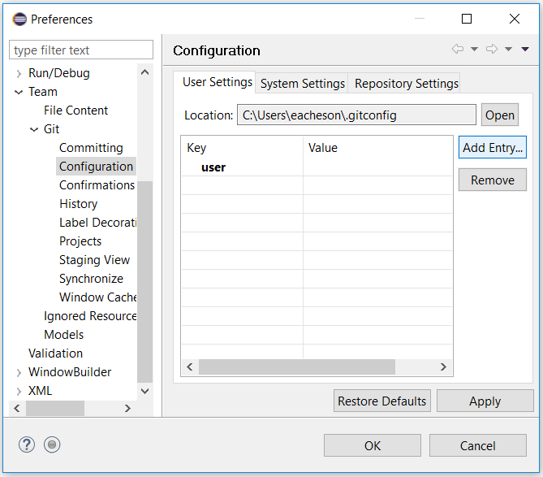
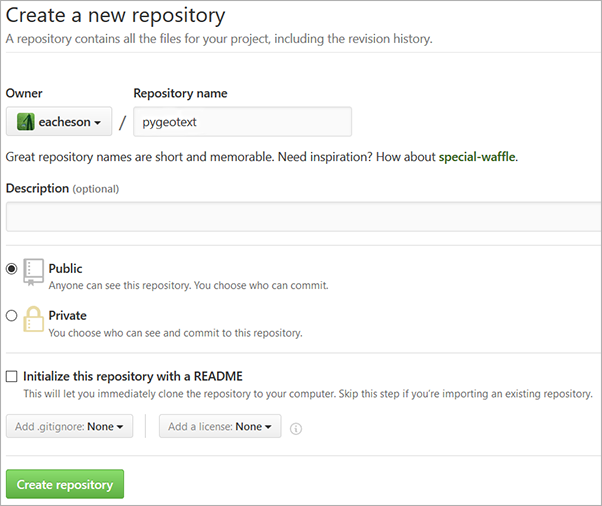
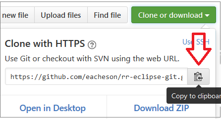
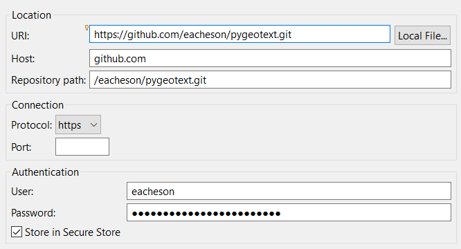
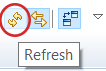

# RR Workshop Tutorial: How to use Git with Eclipse

This tutorial in the context of the **Reproducible Research Workshop** provides you with the first steps on how to use Git with the Eclipse IDE. Eclipse is heavily used to program in Java, as well as in other languages like C++, and even Python (via PyDev).

The repository provides you with a step-by-step tutorial, which you are reading right now, and is at the same time the repository you _play_ with to create your first Git project in Eclipse and make some simple file changes within it.

**Objectives of this tutorial:**

* Set up and install Eclipse with EGit, and get a GitHub account
* Clone/fork an existing project from GitHub and import it into Eclipse
* Commit changes to a file in the GitHub project from Eclipse

## Part 1: Installation and setup

To get started you need the following software installed on your computer: **Eclipse**, and **EGit**. Additionally you will also need a **GitHub** account.

1. **Eclipse ([Download Eclipse](https://www.eclipse.org/downloads/)):** Download and install Eclipse (if not already installed). The recommended version tested with this tutorial is [Eclipse Mars 4.2](https://eclipse.org/downloads/packages/release/Mars/2), _Eclipse IDE for Java Developer_.
2. **EGit**: EGit is a plugin for Eclipse which allows you to interface with Git. Since version control is becoming less and less optional, EGit now comes pre-installed with Eclipse downloads! In case you do have an older version of Eclipse, install EGit as described in [Installing EGit in Eclipse] (http://eclipsesource.com/blogs/tutorials/egit-tutorial/).
3. **GitHub account**: On [GitHub](https://github.com/) create yourself a free GitHub account. _If you are new to Git follow the 15 min [TryGit Tutorial](https://try.github.io) to get a quick introduction to Git._ 
4. **Configure EGit:** to use your GitHub username and password.
  1. Click on the 'Window' menu bar option, then choose 'Preferences'.
  2. Type "git" in the search bar, then choose that path 'Team > Git > Configuration'. Click 'Add Entry...'.
  3. Enter `user.name` as the Key, and your GitHub username as the Value, then add another entry with `user.email` as the Key and your corresponding email as the Value.
    
    

## Part 2: Create a project with GitHub and Eclipse

There are a few ways you can create a version controlled project to use with Eclipse. We will focus on a very common workflow (and increasingly common as GitHub becomes more ubiquitous): first creating a "remote" repository on GitHub, then importing this repository or "repo" into Eclipse.

**1. _(Optional)_ Create a new (public or private) repo on github:** This step is optional but a good idea if you are currently working on a project you want to version control. The rest of the tutorial will use an existing repo we created for this tutorial.

  Creating your own GitHub repo is simply a matter of filling out one screen. Login to your GitHub account and create a new GitHub repository [at this link](https://github.com/new). Give your new repository a short and memorable name, ideally using lowercase letters only and dashes to separate words, e.g. `rr-eclipse-git`, and check the option to initialize this repository with a README:

  **Note:** Public repos are always free, and private repos are free when you get a free student account, and otherwise you currently have to pay $7/month to get unlimited private repos. Applying for a [free student account](https://education.github.com/pack) is highly recommended! (It will probably take several days before you get your application approved.)

  

  Click the green 'Create repository' button to create your repository.  
  You've just created a repo which is 'hosted' by GitHub - it's still only online for now.

**2. Clone the repo:** To get the contents of a remote repository onto your own computer, i.e. to get a 'local' copy, you have to "Clone or download" it. There are a few options here (clone or download? HTTPS or SSH? etc.) but to keep things simple, we will use **Clone** with **HTTPS**. We will use the existing tutorial repo for this step, but you could also use your own repo if you created on in Step 1 above.
  1. Go to the repo homepage at [github.com/eacheson/rr-eclipse-git](https://github.com/eacheson/rr-eclipse-git)
  2. Click the green 'Clone or download' button
  3. A menu appears, which should say 'Clone with HTTPS'; if it instead says 'Clone with SSH', click on 'Use HTTPS'
  4. Click on the copy-to-clipboard button

  

**3. Import the repo into Eclipse:** We don't yet physically have a local copy of the repo, but Eclipse is going to take care of the details for us.
  1. Open Eclipse, with E-Git installed (you will quickly find out if you have an older version without it).
  2. In Eclipse, choose 'File' (top left), then 'Import...'
  3. In the dialog that opens, choose 'Git > Projects from Git' and click 'Next'
  4. Click on 'Clone URI', then click 'Next'
  5. Here's where some magic happens: on this next screen the details should already be filled out for you, as shown below.
    
    
    
    Ensure that your GitHub username and password are entered under 'Authentication', and click Next.
    
  6. For the `rr-eclipse-git` repo, there should only be one branch showing on the next screen, click 'Next'
  7. Choose a directory where the local copy of the repo should live, and click 'Next'
	*Tip*: On my Windows computer, I have a 'git' directory in my home directory, where any git projects go. So with the repo name 'rr-eclipse-git', the directory here would be `C:\Users\eacheson\git\rr-eclipse-git`
  8. On the next screen choose 'Import as general project', click 'Next'
  9. On the final screen, keep the default Project name, which should match the repo name (this is really recommended!!), and click 'Finish'!!
 
That's it! The project should now be on your local machine, and visible in Eclipse in the 'Project Explorer'. If you don't see this window on the left side, make it visible by clicking on 'Window > Show View > Project Explorer'.  

## Part 3: Interact with the repo from Eclipse

In this part, you will used Eclipse to make changes to a file in your 'local'  repo and then to 'commit' the changes to the remote repository.

First of all, make the 'Git Repositories' and the 'Git Staging' windows visible:
  1. 'Window > Show View > Other...'
  2. Expand 'Git' (click on the little arrow on the left) and choose 'Git Repositories' and 'Git Staging', then click Ok.
  
    *Tip*: A setup I personally like in Eclipse is to have Project Explorer on the left, Git Repositories/Git Staging/Outline on the right (tabbed), the main editor in the middle, and the Console/History/Javadoc/other below the main editor.

About the **Git Repositories** window:
- This window shows a list of versioned controlled repositories that you have imported into Eclipse, or created within Eclipse. Right-clicking on a repository within this window gives you many useful options to manage and work with the repository, like 'Pull' to get any news changes from the remote repo into your local copy.
- Expand a repo by clicking on the little arrow to the left of the yellow reop logo. You can now see 'Branches', 'Remotes' and more, which you can expand further.

About the **Git Staging** window:
- This window is where the EGit magic mainly happens. It helpfully shows the graphical equivalent of what has to be done when interacting with Git on the command line.
- New or modified files show up in the 'Unstaged Changes' area. You may have to press refresh, via F5 or the icon with two little curved yellow arrows.

  
  
- To prepare a commit, files from this area need to be selected and dragged down to the 'Staged Changes' area below. Once dragged, these files are staged and ready to be committed. The message to describe the commit gets written in the 'Commit Message' area, and you commit your changes using one of the buttons at the bottom. 'Commit and Push' is what I normally use for solo projects and what we will use next; 'push' means to send your changes to the remote repository, i.e. in our case on GitHub where others can see the changes also.

We will now modify an existing file locally, and use these windows to make a 'Commit and Push'.

1. In the 'Git Repositories' window, right-click on the `rr-eclipse-git` project and select 'Pull'. Click ok the status message that appears, telling you whether anything was downloaded from the remote repository to your local machine. This is really important to do because others will be editing this file too during this tutorial, so you want to get the latest version! Make sure you complete steps 2-6 in about a minute after you do the 'Pull' to minimize the chance of someone having updated the file exactly between your 'Pull' and your 'Push'.
2. In the Eclipse 'Project Explorer' on the left, expand the `rr-eclipse-git` project and double-click on the file 'names.txt' to open it in the Editor window.
3. Add your GitHub username to this file on a new line and save the change (e.g. by pressing Ctrl-S).
4. Now go the the 'Git Staging' window discussed above, press Refresh, and drag the 'names.txt' file (only this file) from the 'Unstaged Changes' area to the 'Staged Changes' area.
5. In the 'Commit Message' area, write a short descriptive summary of your changes, like "added GitHub username to list"
6. Ensure your 'Author' and 'Committer' fields are filled with your username and e-mail, and click the 'Commit and Push' button to get your changes to GitHub!

Hopefully now you get a nice message that everything went well! :D

## Conclusion

This tutorial focused on a simple use case where you are not expecting others to be editing the same file at the same time. You can use the workflow above to version control your own project, and also to collaborate with someone on a project. Where this simple workflow is not adequate is when you are collaborating with multiple people at the same time on a project, where they may be changing the same files at the same time as you. Git is built for these more complex situations, through [branching and merging](https://git-scm.com/book/en/v2/Git-Branching-Basic-Branching-and-Merging), which are beyond the scope of this tutorial, but well integrated into Eclipse and EGit.

Next time someone points you to a GitHub repository for project code and documentation, why not import the project into Eclipse and see if you can follow their instructions and get their code to run?

## Useful links

- [EclipseSource EGit tutorial](http://eclipsesource.com/blogs/tutorials/egit-tutorial/): good tutorial about using EGit
- [Git version control with Eclipse (EGit)](http://www.vogella.com/tutorials/EclipseGit/article.html): a longer tutorial on EGit which documents many more possible workflows
- [GitHub free student account](https://education.github.com/pack): apply for a free student account at GitHub so that you can also create private repos for free.
- [Git: Basic branching and merging](https://git-scm.com/book/en/v2/Git-Branching-Basic-Branching-and-Merging): official Git documentation about branching and merging.
